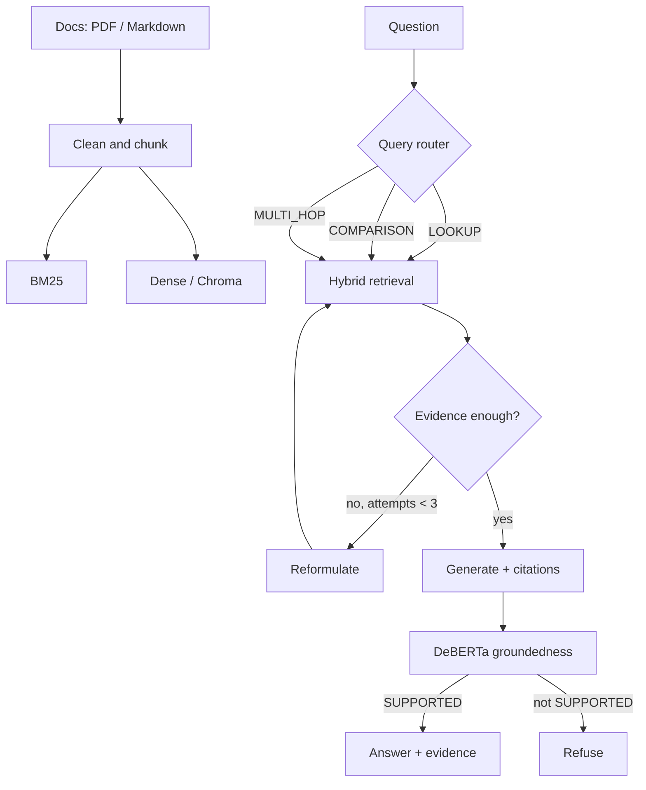

# DocuVerify

**An agentic RAG that verifies its own answers — then refuses when the documents do not support them.**

[Live demo](https://docuverify-six.vercel.app) · [OpenAPI](https://github.com/devcodes007/Docuverify_2#run-locally)

Ask a question over a document set. DocuVerify decides *how* to retrieve, checks whether the evidence is enough, retries when it is not, and runs a **fine-tuned transformer** against the generated answer before anything reaches the UI.

`RAG` `FastAPI` `TypeScript` `Sentence-Transformers` `ChromaDB` `DeBERTa` `BM25`

---

## Why this exists

A `query → vector search → LLM` pipeline treats retrieval as one unconditional step and trusts whatever the model writes.

DocuVerify treats three things as decisions:

1. **How to retrieve** — lookup vs comparison vs multi-hop.
2. **Whether retrieval worked** — top-k is not automatically enough evidence. Up to 3 retries when it is not.
3. **Whether the answer is grounded** — a second model (DeBERTa-v3-small), not another LLM prompt, labels `SUPPORTED` / `CONTRADICTED` / `UNSUPPORTED`. Unsupported answers are refused.

Document-level train/val/test splits block leakage. FastAPI serves PDF ingest, citations, verification, and streaming agent traces. The TypeScript frontend calls those APIs.

---

## Pipeline

```
query → classify (LOOKUP / COMPARISON / MULTI_HOP)
      → retrieve (BM25 + dense + hybrid, ≤3 attempts)
      → generate (evidence-only prompt, citations)
      → verify (fine-tuned SUPPORTED / CONTRADICTED / UNSUPPORTED)
      → retry once on failure, then refuse rather than hallucinate
```



Full component map: [`ARCHITECTURE.md`](ARCHITECTURE.md)

---

## Highlights

- Hybrid BM25 + dense retrieval, with identifier-aware BM25 tokenization
- Agentic routing and evidence-gap retries (bounded at 3)
- Independent DeBERTa-v3-small groundedness classifier
- Leakage-safe splits by `document_id`, not by example
- FastAPI backend: ingest, query, SSE traces, `/evaluate`
- TypeScript UI for live answers, citations, and groundedness state

---

## Run locally

```bash
python -m venv .venv
# Windows: .\.venv\Scripts\Activate.ps1
source .venv/bin/activate
pip install -r requirements.txt
cp .env.example .env
uvicorn app.main:app --reload
```

Backend: [http://localhost:8000/docs](http://localhost:8000/docs)

```bash
cd frontend && python -m http.server 8080
```

Frontend: [http://localhost:8080](http://localhost:8080) — set the API base URL to `http://localhost:8000`.

```bash
docker compose up --build
```

```bash
pytest
```

---

## API

```bash
curl -X POST localhost:8000/query \
  -H "Content-Type: application/json" \
  -d '{"question": "How does dependency injection interact with validation?", "debug": true}'
```

Also: `GET /health`, `POST /ingest`, `POST /ingest/pdf`, `POST /query/stream`, `POST /evaluate`, `POST /retrieve`.

---

## Training the groundedness model

```bash
python -m training.generate_dataset --raw-dir data/raw --out data/processed/groundedness_raw.jsonl
python -m training.prepare_dataset --in data/processed/groundedness_raw.jsonl --out-dir data/processed
python -m training.train --train data/processed/groundedness_train.jsonl --val data/processed/groundedness_val.jsonl \
    --base-model microsoft/deberta-v3-small --out models/groundedness-classifier --epochs 3 --batch-size 8
```

Without a saved classifier, the API falls back to a lexical heuristic and says so on `/health`. That fallback is not the reported system.

---

## Honest limits

- The bundled sample corpus is small; ingest your own PDFs for a real evaluation.
- Query decomposition is connective-based, not a learned planner.
- Quantify groundedness from `training/evaluate.py` on the fine-tuned model, not from the heuristic fallback.

---

## Layout

```text
app/           FastAPI, agents, retrieval, verification
training/      dataset + DeBERTa fine-tune
evaluation/    retrieval / RAG / groundedness scripts
frontend/      TypeScript UI
tests/
```
