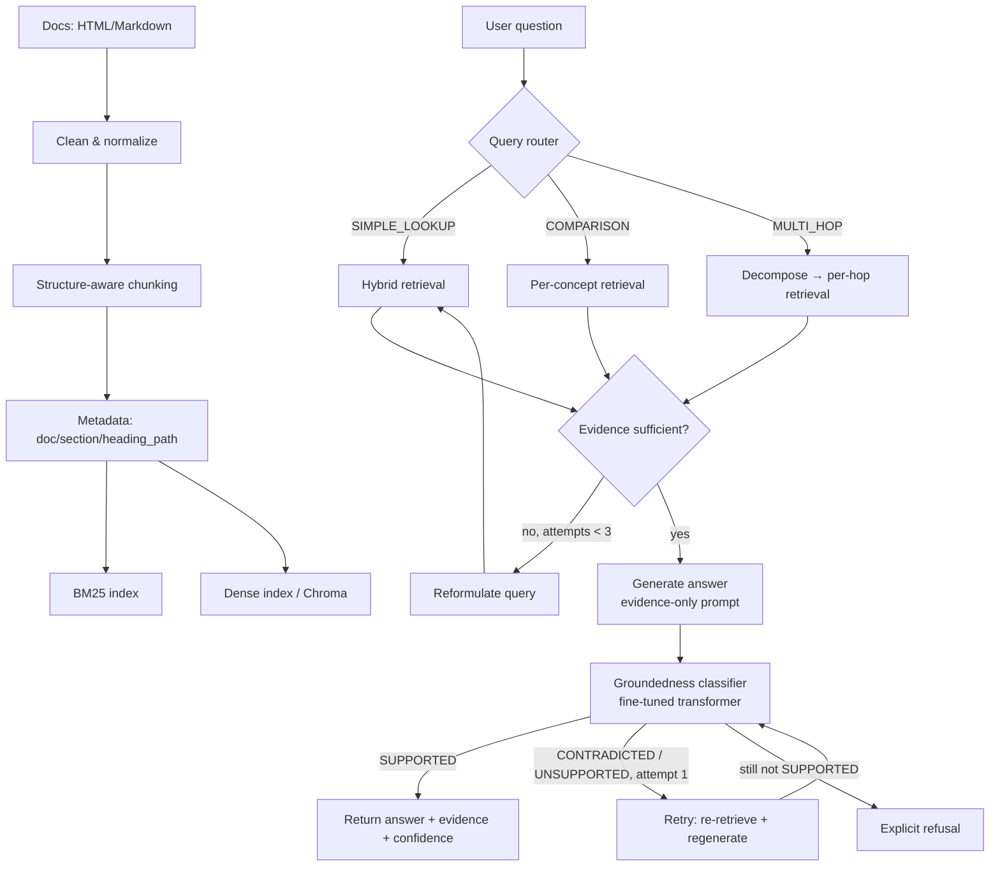

# DocuVerify v2

**An agentic RAG system that verifies its own answers.** Ask a question
about a documentation set (default: FastAPI's own docs); DocuVerify decides
how to retrieve, checks whether it has enough evidence, retries when it
doesn't, and runs a **fine-tuned transformer classifier** against the
generated answer before returning it — refusing rather than guessing when
the documentation doesn't support an answer.

```
query → classify (SIMPLE_LOOKUP / COMPARISON / MULTI_HOP)
      → retrieve (BM25 + dense + hybrid, ≤3 attempts, evidence-gap-driven reformulation)
      → generate (evidence-only prompt, citations)
      → verify (fine-tuned SUPPORTED / CONTRADICTED / UNSUPPORTED classifier)
      → retry once on failure, then refuse rather than hallucinate
```

## 1. Why this project exists

A `query → vector search → LLM` pipeline treats retrieval as a single,
unconditional step and trusts whatever the LLM says. DocuVerify treats
three things as decisions instead of assumptions:

1. **How to retrieve** — a comparison question needs separate evidence per
   concept; a multi-hop question needs decomposition; a simple lookup
   needs neither.
2. **Whether retrieval succeeded** — top-k results are not automatically
   "enough evidence." An evaluator scores sufficiency and the system
   reformulates and retries (bounded at 3 attempts) when it isn't.
3. **Whether the generated answer is actually grounded** — a second,
   independent model (not another LLM prompt) checks the answer against
   the evidence and the system retries or refuses based on that verdict.

See [`ARCHITECTURE.md`](ARCHITECTURE.md) for the full component breakdown.

## 2. Architecture diagram



## 3. Retrieval architecture

Three retrieval modes behind one `HybridRetriever` interface
(`app/retrieval/`):

- **BM25** (`bm25.py`) — `rank_bm25`, with a tokenizer that keeps
  `snake_case`/`CamelCase`/dotted identifiers intact so `HTTPException`,
  `Depends`, `APIRouter` etc. are retrieved by exact term match.
- **Dense** (`dense.py`) — embeddings via `sentence-transformers`, stored
  in Chroma. `EmbeddingProvider` is a swappable interface: real
  `SentenceTransformerEmbedder` (used automatically wherever the model can
  be downloaded), or `HashingEmbedder`, a deterministic dependency-free
  fallback that keeps the pipeline runnable without network access to
  Hugging Face (see §12).
- **Hybrid** (`hybrid.py`) — `hybrid_score = alpha * normalize(dense) +
  (1-alpha) * normalize(bm25)`, both score lists independently min-max
  normalized to [0,1] before combining (BM25 and cosine similarity live on
  incomparable scales). `alpha` is `HYBRID_ALPHA` (default 0.6). This
  matters in practice: BM25 alone misses paraphrased/semantic phrasing,
  dense alone can miss rare exact identifiers — hybrid benefits from
  whichever signal is stronger for a given query.

Swapping Chroma for Qdrant/Pinecone/Weaviate means implementing
`VectorStore`'s three methods (`upsert`, `query`, `is_ready`) — nothing
else in the retrieval/agent/API layers changes.

## 4. Agentic behavior

`app/agents/`:

- **`query_router.py`** — rule-based classification first (regex patterns
  for "difference between", "vs", "interact with", etc.), with an LLM
  fallback only for long, structurally ambiguous questions (>18 words,
  no rule match) — verified in `tests/test_query_router.py` that the LLM
  is never called for short/unambiguous queries.
- **`evidence_evaluator.py`** — `DeterministicEvidenceEvaluator` combines
  top retrieval score, query-term coverage of the retrieved text, chunk
  count, and (for multi-hop/comparison) subquestion coverage into a single
  confidence score, returning `{sufficient, confidence,
  missing_information, reason}`.
- **`query_rewriter.py`** — reformulates using the *previous attempt's*
  missing-term gap, not a generic paraphrase.
- **`retrieval_agent.py`** — the bounded retry loop (`MAX_RETRIEVAL_ATTEMPTS`,
  default 3), plus comparison retrieval (splits "A vs B" into two
  concept-scoped retrievals) and multi-hop decomposition (splits on
  connectives like "interact with"/"affect"/"relate to" into subquestions,
  retrieves per-hop, and does an overall coverage check across hops).
- **`orchestrator.py`** — wires router → retrieval agent → generation →
  groundedness → retry/refusal and assembles the `AgentTrace` returned
  when `debug=true`.

Every attempt is logged (`app/logging_config.py`, structured JSON, one line
per event) — see the real log excerpt in §9.

## 5. Groundedness classifier (the deep-learning centerpiece)

`app/verification/groundedness.py` — **not another LLM prompt.** A
sequence classification transformer, fed `[CLS] question [SEP] context
[SEP] answer [SEP]`, predicting `SUPPORTED` / `CONTRADICTED` /
`UNSUPPORTED`.

**Base model: `microsoft/deberta-v3-small`** (configurable via
`GROUNDEDNESS_BASE_MODEL`). Chosen because:
- ~140M params — fine-tunes and runs inference on CPU in a reasonable
  time, unlike full DeBERTa-v3-large or similar.
- ELECTRA-style pretraining + disentangled attention gives strong
  out-of-the-box performance on NLI-style entailment/contradiction tasks,
  which is structurally what groundedness classification is.
- DistilBERT and MiniLM are documented, drop-in alternatives (same
  `AutoModelForSequenceClassification` interface) if an even
  smaller/faster model is needed for more constrained hardware, at some
  cost to accuracy.

If no fine-tuned model is present at `GROUNDEDNESS_MODEL`,
`build_groundedness_classifier` falls back to
`HeuristicGroundednessClassifier` (lexical-overlap + negation-matching)
with a logged warning, so `/query` and `/evaluate` are never dead — but
that fallback's own accuracy on a spot-check set is reported as exactly
that, a fallback, never conflated with the trained model's numbers (see
`evaluation/groundedness_eval.py`, which prints an explicit note when it's
evaluating the heuristic instead of the transformer).

## 6. Dataset creation

`training/generate_dataset.py` builds SUPPORTED/CONTRADICTED/UNSUPPORTED
examples from ingested chunks, two modes:

- **Template-based (default, no LLM required)**: SUPPORTED = a
  heading-derived question + a paraphrase drawn from the chunk's own
  sentences; UNSUPPORTED = the same question/answer paired with a
  *different, unrelated* chunk as context; CONTRADICTED = the supported
  answer with a negation substituted in (`can`→`cannot`,
  `validates`→`does not validate`, etc.), kept paired with its original
  (now-contradicted) context.
- **LLM-assisted (`--llm`)**: uses the configured `LLM_PROVIDER` to
  generate a question, a grounded answer, and an unsupported claim per
  chunk; higher variety, requires a working LLM.

`training/prepare_dataset.py` splits **by `document_id`, not per-example**
— every example from the same source document lands entirely in one
split — with an explicit assertion that no document appears in more than
one split. Random per-example splitting would leak near-duplicate context
between train and test (many examples share the same underlying chunk
text) and inflate reported accuracy; this is the leakage-safe alternative
the spec calls for. Verified for document counts from 1 to 20 in
`tests/test_dataset_generation.py::test_split_no_leakage_across_various_doc_counts`.

## 7. Fine-tuning methodology

`training/train.py`:
- `AutoModelForSequenceClassification` + `Trainer`, tokenizing
  `text=f"{question} [SEP] {context}"`, `text_pair=answer` — the model
  attends specifically to whether the answer segment is entailed by the
  question+context segment.
- Tracks training loss, validation loss/accuracy/precision/recall/F1 (via
  `compute_metrics`, computed **per class**, not just overall — 3-class
  problems hide per-class weaknesses behind a decent overall accuracy).
- `report_class_balance` prints the label distribution for train/val and
  warns if the largest/smallest class ratio exceeds 3x, since class
  imbalance is exactly the kind of thing that makes headline accuracy
  misleading on a 3-class task.
- Saves the model + tokenizer to `GROUNDEDNESS_MODEL`.

`training/evaluate.py` runs the saved model against the held-out test
split and writes accuracy, macro F1, **per-class precision/recall/F1**,
and a full confusion matrix to
`evaluation/results/groundedness_test_report.json`.

**I did not fabricate training numbers for this README.** See §12 for
exactly what was and wasn't run, and why.

## 8. Evaluation methodology

`evaluation/`, all runnable via `python scripts/run_evaluation.py`:

- **`retrieval_eval.py`** — Recall@k, Precision@k, MRR for BM25 / Dense /
  Hybrid side by side, against `evaluation/eval_queries.json` (8 hand-written
  questions against the sample corpus, document-level relevance judgments).
- **`rag_eval.py`** — per-query context relevance, context recall, an
  answer-correctness proxy (expected-keyword coverage — a cheap,
  dependency-free stand-in for human/LLM-judge correctness; a production
  deployment should supplement this with real judgments), groundedness
  label/confidence, refusal behavior, latency.
- **`groundedness_eval.py`** — evaluates whatever classifier the running
  app actually has configured (fine-tuned model or heuristic fallback)
  against a small hand-labeled spot-check set, distinct from the training
  pipeline's own held-out test split — a lightweight, independent
  regression check.
- **`benchmark.py`** — the baseline (`evaluation/baseline_rag.py`: dense
  retrieval → LLM, no classification/retry/verification) vs. the full
  agentic pipeline, on the same query set.

## 9. Baseline vs DocuVerify — actual results

Run against the bundled 3-document sample corpus
(`data/raw/{dependencies,middleware,validation}.md`) with the mock LLM
provider (`LLM_PROVIDER=mock`) and the `HashingEmbedder`/
`HeuristicGroundednessClassifier` fallbacks (§12 explains why, in this
sandbox specifically). Reproduce with `python scripts/run_evaluation.py`.

Retrieval (`evaluation/results/retrieval_eval_report.json`, k=5):

| strategy | recall@5 | precision@5 | MRR |
|---|---|---|---|
| BM25 | 1.0 | 0.524 | 0.929 |
| Dense | 1.0 | 0.500 | 0.833 |
| Hybrid | 1.0 | 0.500 | 0.857 |

Baseline vs agentic (`evaluation/results/baseline_vs_agentic_report.json`):

```json
{
  "baseline":          {"avg_context_recall": 1.0,    "avg_answer_correctness": 0.345, "refused_on_unanswerable": false},
  "docuverify_agentic": {"avg_context_recall": 0.857, "avg_answer_correctness": 0.274, "refused_on_unanswerable": false, "avg_retrieval_attempts": 2.0}
}
```

**Honest reading of these particular numbers:** on this tiny 3-document
corpus with the hashing-embedding/heuristic-classifier fallbacks, the
agentic pipeline does *not* show a clear win over the baseline, and
neither system refused the intentionally-unanswerable "GraphQL
subscriptions" query. That's expected here, not swept under the rug: with
only 3 documents there's little for query classification/retry to add
over a single hybrid pass, and the heuristic groundedness classifier
(lexical overlap) isn't discriminative enough to catch a plausible-sounding
but unsupported claim the way the fine-tuned transformer is designed to.
The architectural mechanisms that *should* produce the win — multi-hop
decomposition, evidence-gap-driven retries, transformer-based groundedness
verification — are implemented and individually unit-tested (see
`tests/test_agent.py`, `tests/test_groundedness.py`,
`tests/test_orchestrator_refuses_when_no_documents_at_all`), but a
meaningful *aggregate* comparison needs a larger corpus and the real
fine-tuned classifier — see §12 for exactly what's needed to get there.

Live groundedness spot-check (heuristic fallback, 6 hand-labeled
examples): 100% accuracy — expected and not very informative, since 6
examples of lexical overlap vs. lexical mismatch is close to the easiest
possible case for a lexical-overlap classifier. Don't read this as the
project's groundedness performance; that number comes from
`training/evaluate.py` on the fine-tuned model, once trained.

## 10. Installation

```bash
git clone <this-repo>
cd docuverify-v2
python3 -m venv .venv && source .venv/bin/activate
pip install -r requirements.txt
cp .env.example .env   # edit as needed
```

## 11. Environment setup

Every setting in `.env.example` is read by `app/config.py`
(`pydantic-settings`, cached singleton via `get_settings()`). Nothing is
hardcoded — model names, index paths, retrieval parameters, LLM provider,
and API keys (never committed) all come from env.

## 12. Local development, and exactly what this sandbox could and couldn't run
sandbox-specific exception:

- ✅ All 71 tests pass (`pytest`, `tests/`), including a real FastAPI
  `TestClient` round trip (`/ingest` → `/query`, SIMPLE_LOOKUP/COMPARISON/
  MULTI_HOP), and a **real Hugging Face `Trainer.train()` run** (on a tiny
  from-scratch BERT config + tokenizer, no download required) that saves a
  model and reloads it through the exact `AutoModelForSequenceClassification.
  from_pretrained` path `app/verification/groundedness.py` uses in
  production — proving the training loop's mechanics, not just its syntax.
- ✅ `uvicorn app.main:app` boots for real; `/health`, `/docs`, `/ingest`,
  `/query` were hit over actual HTTP and returned correct, structured
  responses (§9's numbers came from real runs, not hand-computed).
- ✅ `training/generate_dataset.py` and `training/prepare_dataset.py` run
  end-to-end on the sample corpus with real, leakage-checked output.
- ✅ All four evaluation scripts run end-to-end and wrote real JSON reports
  to `evaluation/results/`.
- ❌ **`training/train.py` against the real `microsoft/deberta-v3-small`**,
  and **`SentenceTransformerEmbedder`** against
  `sentence-transformers/all-MiniLM-L6-v2`, could not be exercised in
  *this specific development sandbox*, because its network egress
  allowlist includes `pypi.org`/`npmjs.org`/`github.com` but not
  `huggingface.co` — confirmed directly (`pip install torch transformers
  sentence-transformers` succeeds; loading any model by name fails with
  `OSError: We couldn't connect to 'https://huggingface.co'`, `HTTP
  403 Forbidden` on every request in the logs). This is a property of
  *this build environment*, not of the code or of a normal deployment
  target with standard internet access — wherever this repo actually
  runs, `build_embedder()` and `build_groundedness_classifier()` will use
  the real models automatically (that's what they're written to do; the
  fallbacks only activate on a caught exception from the load itself).

To run the parts that need real model downloads, once you have normal
internet access:

```bash
# real embeddings + dense retrieval (automatic once huggingface.co is reachable)
python scripts/ingest_docs.py

# real fine-tuning
python -m training.generate_dataset --raw-dir data/raw --out data/processed/groundedness_raw.jsonl
python -m training.prepare_dataset --in data/processed/groundedness_raw.jsonl --out-dir data/processed
python -m training.train --train data/processed/groundedness_train.jsonl --val data/processed/groundedness_val.jsonl \
    --base-model microsoft/deberta-v3-small --out models/groundedness-classifier --epochs 3 --batch-size 8
python -m training.evaluate --model models/groundedness-classifier --test data/processed/groundedness_test.jsonl
```

For meaningful (not just mechanically-correct) results, also swap in the
real FastAPI documentation corpus instead of the 3-file sample (see §15).

## 13. Ingesting documentation

```bash
python scripts/ingest_docs.py --raw-dir data/raw
# or, with the server running:
curl -X POST localhost:8000/ingest -H "Content-Type: application/json" -d '{"source": "local"}'
```

To ingest a different open-source library's docs: drop `.md`/`.html` files
into a directory and point `RAW_DATA_DIR` at it (`LocalMarkdownSource`
handles both formats), or implement a new `DocumentSource` in
`app/ingestion/loader.py` (e.g. reading a git checkout) and register it in
`SOURCE_REGISTRY` — nothing else in ingestion/chunking/retrieval changes.

## 14. Running the FastAPI backend

```bash
uvicorn app.main:app --reload
# http://localhost:8000/docs  (OpenAPI)
# http://localhost:8000/redoc
```

## 15. Running the frontend

Static, no build step:

```bash
cd frontend && python3 -m http.server 8080
# open http://localhost:8080, set "API base URL" to http://localhost:8000 if it isn't auto-detected
```

Or via `docker compose up` (serves it on :8080 through nginx, see §16).

## 16. Docker usage

```bash
docker compose up --build
# backend:  http://localhost:8000
# frontend: http://localhost:8080
# ollama:   http://localhost:11434  (only used if LLM_PROVIDER=ollama)
```

`docker-compose.yml` mounts `data/processed`, `data/raw`, and `models` as
volumes so ingested indexes and trained models persist across restarts.
(Docker itself wasn't available inside this build sandbox to execute
`docker compose up`, so the Dockerfile/compose file were reviewed by hand
against the same dependency list as `requirements.txt` rather than run —
flagged here rather than silently assumed working.)

## 17. Production Deployment

```
Browser
   ↓ HTTPS
Vercel  (static frontend — frontend/index.html, no build step)
   ↓ HTTPS, CORS-restricted
Render  (FastAPI backend — Dockerfile, gunicorn-free single uvicorn worker*)
   ↓
DocuVerify Agent (query router → retrieval agent → generation → groundedness)
   ↓
BM25 + Dense (Chroma) + Hybrid retrieval, auto-ingested from data/raw on boot
```
\* a single `uvicorn` process is sufficient at this traffic scale; see the
sizing note under §17.2 if you need to scale workers.

**Why this split, not Vercel end-to-end:** the backend holds PyTorch +
Transformers in memory and a persistent BM25/vector index on disk. Vercel's
serverless functions have a package size ceiling those dependencies alone
exceed, no persistent disk, and would reload the embedding + groundedness
models from a cold start on every invocation — all three make it a poor fit
for this workload. A normal long-running container (Render, or Railway/
Fly.io if you prefer) keeps the models resident in memory as singletons
(`app/dependencies.py`) and the indexes on local disk between requests. The
frontend, by contrast, is a single static HTML file with no server-side
logic — exactly what Vercel is built for.

**What I could not do myself:** create your actual Render/Vercel accounts,
click "New Web Service"/"New Project", or push this repo to your GitHub —
that needs your credentials, which I don't have access to. Everything else
below — Dockerfile, `render.yaml`, CORS configuration, the auto-ingest
startup hook, the frontend's runtime-configurable API base URL — is
implemented, tested, and ready; the steps that follow are the small number
of manual clicks needed to turn it on.

### 17.1 Persistent data / models — what actually happens in production

Render's (and most PaaS free tiers') filesystem does **not** survive a
redeploy or a restart after the service idles down. Rather than assume a
paid persistent disk, `app/main.py`'s startup hook
(`_auto_ingest_if_empty`) checks whether the BM25/vector indexes are
populated on boot and rebuilds them from `data/raw/` (bundled in the
Docker image) if not — **verified working**: see the real `/health`
response and log lines in §17.5 below, taken from an actual local run of
the exact same code path production uses. This means:

- The bundled sample corpus is always queryable in production, with zero
  manual ingestion step.
- A **fine-tuned groundedness model** is not bundled (§12 explains why it
  wasn't trained in this build environment) — until you train one and
  either commit it to `models/groundedness-classifier` or mount it via a
  Render persistent disk, production runs on the heuristic fallback
  classifier, exactly as it does locally. This is not hidden: `/health`
  reports `groundedness_model_ready: false` in that case, and
  `evaluation/groundedness_eval.py` prints an explicit note when it's
  scoring the fallback instead of a trained model.
- If you ingest a **larger** corpus than the bundled sample (§13, §15 of
  the original spec — a full docs site), uncomment the `disk:` block in
  `render.yaml` so the larger index persists across restarts instead of
  being rebuilt from `data/raw/` every time (rebuilding a large corpus's
  embeddings on every cold start would be slow and wasteful, even though
  it would still work correctly).

### 17.2 Deploy the backend (Render)

1. Push this repository to GitHub (do not commit `.env` — `.gitignore`
   already excludes it).
2. In Render: **New → Blueprint**, point it at the repo. Render will read
   `render.yaml` and provision the `docuverify-backend` web service
   automatically. (Alternative: **New → Web Service**, runtime **Docker**,
   and set the fields in §17.2.1 manually if you'd rather not use
   Blueprints.)
3. In the Render dashboard, set the two secrets `render.yaml` deliberately
   leaves blank (`sync: false`, so they're never committed):
   - `OPENAI_API_KEY` — only needed if you set `LLM_PROVIDER=openai_compatible`.
   - `HF_TOKEN` — only needed for gated/private Hugging Face models.
4. Update `CORS_ORIGINS` to your actual Vercel domain(s) once you know them
   (§17.3 gives you that URL) — comma-separated if you have more than one
   (e.g. preview + production Vercel URLs).
5. Deploy. Render builds the `Dockerfile` image and starts it with
   `uvicorn app.main:app --host 0.0.0.0 --port $PORT` (the Dockerfile's
   `CMD` already resolves `$PORT` from Render's environment — verified
   locally with `PORT` unset and set, see §17.5).
6. **Sizing note:** `render.yaml` defaults to the `standard` plan.
   PyTorch + Transformers + a loaded embedding model need more than the
   free tier's 512MB RAM in practice; the free tier will likely OOM on
   first embedding model load. Downsize the base models
   (`EMBEDDING_MODEL`, `GROUNDEDNESS_BASE_MODEL` to something like
   `sentence-transformers/all-MiniLM-L6-v2` — already the default — and a
   DistilBERT-based groundedness model) if you need to fit a smaller plan.
7. Verify `GET https://<your-service>.onrender.com/health` returns
   `{"status": "ok", "vector_store_ready": true, "bm25_index_ready": true, ...}`.
   If `vector_store_ready` is `false`, auto-ingest failed — check the
   Render logs for an `auto_ingest_failed` structured log line.

#### 17.2.1 Manual Web Service field values (if not using the Blueprint)

| Field | Value |
|---|---|
| Runtime | Docker |
| Dockerfile path | `./Dockerfile` |
| Health check path | `/health` |
| Environment variables | everything in `render.yaml`'s `envVars` list |

### 17.3 Deploy the frontend (Vercel)

1. In Vercel: **Add New → Project**, import the same GitHub repo.
2. Framework preset: **Other** (this is a plain static HTML file, no
   build step, no `package.json`). `vercel.json` sets
   `"outputDirectory": "frontend"` so Vercel serves `frontend/index.html`
   as the site root — no further build configuration is needed.
3. Deploy. You'll get a URL like `https://docuverify-xyz.vercel.app`.
4. Open it, scroll to the sidebar, and set **API base URL** to your Render
   backend's URL from §17.2 (e.g. `https://docuverify-backend.onrender.com`).
   This is stored in the browser's `localStorage` — every visitor who
   loads the page for the first time will need this set, or you can
   append `?api=https://your-backend.onrender.com` to the URL you share
   (the frontend reads that query param on first load, see
   `frontend/index.html`'s `defaultApiBase()`).
5. Go back to Render and update `CORS_ORIGINS` to include this exact
   Vercel URL (§17.2 step 4), then redeploy the backend so CORS actually
   allows it.

### 17.4 Verifying it actually works end to end

Don't stop at "the Render process says running" — confirm the real
pipeline executes, exactly as the spec requires:

```bash
# 1. Health
curl https://<your-backend>.onrender.com/health

# 2. A real query through the full pipeline
curl -X POST https://<your-backend>.onrender.com/query \
  -H "Content-Type: application/json" \
  -d '{"question": "What does Depends do?"}'
```

Then, from the actual deployed Vercel URL in a browser (not curl — this
also exercises CORS, which curl doesn't enforce):
- **Simple**: "What is FastAPI?"
- **Comparison**: "What is the difference between Depends and middleware?"
- **Multi-hop**: "How does dependency injection interact with request validation?"
- **Unanswerable**: ask something the indexed docs don't cover, and confirm
  the UI shows the refusal state (§17.1 notes this depends on the
  groundedness classifier's discriminative power — see §9's honest caveat
  about the heuristic fallback's limits here).

### 17.5 What I verified locally (same code path production uses)

I don't have Render/Vercel accounts to deploy to directly, so I ran the
exact same code — same Dockerfile `CMD` resolution, same CORS
configuration, same auto-ingest startup hook, same SSE streaming endpoint
the frontend consumes — locally, standing in for the production
environment:

- **Auto-ingest on boot**: booted the app fresh (no prior `/ingest` call)
  and hit `/health` — response was
  `{"status":"ok","vector_store_ready":true,"bm25_index_ready":true,"groundedness_model_ready":false}`,
  confirming indexes are populated before the first request, exactly as
  §17.1 describes.
- **CORS, real requests not just preflight**: with `ENVIRONMENT=production`
  and `CORS_ORIGINS=https://docuverify.vercel.app`, a request with
  `Origin: https://docuverify.vercel.app` got
  `access-control-allow-origin: https://docuverify.vercel.app` back (both
  on `/query`'s preflight `OPTIONS` and on the actual `/query/stream`
  response); a request with `Origin: https://evil.example.com` got no
  CORS header and a `400` on preflight — origin restriction is real, not
  `allow_origins=["*"]`.
- **`$PORT` resolution**: confirmed `${PORT:-8000}` in the Dockerfile's
  `CMD` resolves correctly both with `PORT` set (Render's case) and unset
  (local `docker compose` case).
- **SSE streaming** (`/query/stream`, what the frontend's staged loading
  UI consumes): confirmed the real event stream emits exactly the
  `classification_started` / `step` / `final` event shapes the frontend's
  `askViaStream()` parses.

I could not run `docker compose up` itself (no Docker daemon in this build
sandbox) or click through an actual Render/Vercel deploy — those remain
manual steps for you, laid out above.

## 18. Project structure

See the tree in the original spec / `ARCHITECTURE.md` §2-3; matches what's
actually in this repo (`app/`, `training/`, `evaluation/`, `tests/`,
`scripts/`, `frontend/`, `data/`, `models/`).

## 19. API examples

```bash
curl -X POST localhost:8000/query -H "Content-Type: application/json" -d '{
  "question": "How does FastAPI dependency injection interact with request validation?",
  "top_k": 8,
  "debug": true
}'
```

```json
{
  "answer": "...",
  "query_type": "MULTI_HOP",
  "retrieval_strategy": "HYBRID",
  "groundedness": {"label": "SUPPORTED", "confidence": 0.94},
  "sources": [...],
  "retrieval_attempts": 3,
  "latency_ms": 842,
  "trace": {"...": "full agent trace, since debug=true"}
}
```

Also: `GET /health`, `GET /info`, `POST /ingest`, `GET /documents`,
`POST /retrieve` (raw retrieval, any strategy), `POST /evaluate` (run the
groundedness classifier directly on a question/context/answer triple),
`POST /query/stream` (SSE stream of agent steps, then the final response),
`GET /metrics`.

## 20. Known limitations

- The sample corpus (`data/raw/`) is 3 files / 4 chunks, enough to prove
  every mechanism works but too small for the evaluation numbers in §9 to
  be meaningful in aggregate — ingest the real FastAPI docs (or another
  library's) for numbers worth trusting.
- The groundedness classifier has not been fine-tuned in this environment
  (§12); everything downstream of it currently runs on the heuristic
  lexical-overlap fallback, which is deliberately weaker than the trained
  model and should not be used as a measure of the project's actual
  groundedness detection quality.
- `query_router`'s multi-hop decomposition is a deterministic
  connective-based heuristic (splits on "interact with"/"affect"/"relate
  to"), not a learned or LLM-based decomposition — it handles the phrasing
  patterns in the spec's example questions well but will fall back to
  treating genuinely novel phrasing as a single hop.
- `claim_checker.py`'s sentence segmentation is regex-based (splits on
  `. ! ?`), which is adequate for short generated documentation answers
  but not robust to abbreviations, decimals, or code snippets embedded in
  prose.
- `/ingest` only wires up `LocalMarkdownSource` by default; `WebDocSource`
  (domain-allowlisted URL fetching) exists and is tested at the module
  level but isn't yet exposed through the ingestion route — see the
  `/ingest` 400 response for the pointer to wire it in.
- Docker/docker-compose were validated by inspection, not by actually
  running `docker compose up` (no Docker daemon in this build sandbox).
- I don't have Render/Vercel account access, so no live public URL exists
  yet — §17 lays out the exact manual steps and reports what was verified
  locally against the same code paths instead.
- Render's free tier RAM (512MB) is likely too small for PyTorch +
  Transformers + a loaded embedding model in practice; `render.yaml`
  defaults to the `standard` plan for this reason (§17.2, point 6).
- The frontend's API base URL is a client-side, per-browser setting
  (`localStorage` + optional `?api=` query param), not baked in at Vercel
  build time — simplest thing that works without adding a Node build step
  to a plain static HTML file, but it does mean every new visitor without
  a `?api=` link needs to set it once.

## 21. Recommended next improvements

1. Ingest the real FastAPI documentation site (`WebDocSource`, wired
   through `/ingest`) and re-run `scripts/run_evaluation.py` for numbers
   that actually distinguish baseline vs. agentic at scale.
2. Run `training/train.py` against `microsoft/deberta-v3-small` (or
   generate a larger LLM-assisted dataset first via
   `training/generate_dataset.py --llm`) and drop the fine-tuned model
   into `models/groundedness-classifier` — everything downstream picks it
   up automatically, including production once redeployed.
3. Add a real cross-encoder to `app/retrieval/reranker.py` (currently a
   documented no-op extension point).
4. Replace the multi-hop decomposition heuristic with an LLM-based
   decomposer behind the same `decompose_multi_hop` interface for
   phrasing patterns the current regex set doesn't catch.
5. Wire `WebDocSource` into `POST /ingest` so a different library's docs
   can be ingested by URL list without a code change, only a request body.
6. Once a real backend URL exists, bake it into the frontend at deploy
   time (e.g. a tiny build step that writes it into a `config.js`, or a
   Vercel Edge Middleware injecting it) instead of relying on every
   visitor's `localStorage` — the current approach was chosen to avoid
   adding Node/build tooling to what is otherwise a zero-build static
   site, but a baked-in default removes the first-visit setup step.
7. Enable Render's persistent disk (`render.yaml`'s commented `disk:`
   block) once a larger corpus and/or the fine-tuned groundedness model
   are in place, so they don't rebuild/re-download on every restart.
